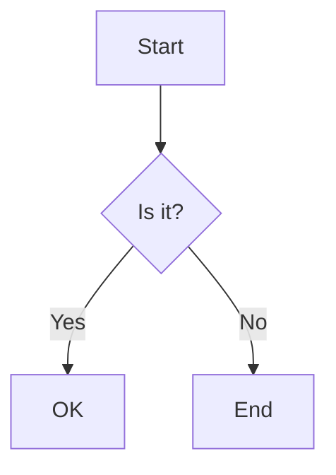

# Documentation Guidelines for TextDAO

This guide outlines the standards and best practices for creating and maintaining documentation in the TextDAO project.

## General Principles

1. Write clear, concise, and accurate documentation.
2. Keep documentation up-to-date with code changes.
3. Use a consistent style and format across all documentation.
4. Write for your audience, considering their technical background.

## Documentation Structure

Each package in the monorepo should have its own `docs/` directory with the following structure:

```
docs/
├── architecture/
│   └── index.md
├── guides/
│   └── index.md
└── development/
    └── index.md
```

## File Naming Convention

Use kebab-case for all documentation file names:

```
component-name.md
usage-guide.md
```

## Markdown Formatting

1. Use ATX-style headers (`#` for h1, `##` for h2, etc.).
2. Use backticks for inline code and triple backticks for code blocks.
3. Use appropriate language identifiers for code blocks (e.g., ```solidity).
4. Use unordered lists (`-`) for most lists, and ordered lists (`1.`) when sequence matters.

## Documentation Header

Each documentation file should start with a single, unified metadata block followed by the document content:

```markdown
---
title: "Full Document Title"
version: X.Y.Z
lastUpdated: YYYY-MM-DD
author: [Author Names]
scope: [Scope of the document, e.g., dev, arch]
type: [Type of document, e.g., spec, guide]
tags: [tag1, tag2, tag3]
relatedDocs: [RELATED_DOC_1.md, RELATED_DOC_2.md]
changeLog:
  - version: X.Y.Z
    date: YYYY-MM-DD
    description: [Description of changes]
  - version: X.Y.(Z-1)
    date: YYYY-MM-DD
    description: [Description of previous changes]
---

# Document Title

Brief description or introduction to the document content.

[Main document content starts here]
```

This unified header format includes all relevant information about the document in a single metadata block.

## Code Documentation

### Solidity

Use NatSpec comments for all public and external functions:

```solidity
/**
 * @notice Calculates the sum of two numbers
 * @param a The first number
 * @param b The second number
 * @return The sum of a and b
 */
function calculateSum(uint256 a, uint256 b) public pure returns (uint256) {
    return a + b;
}
```

### JavaScript/TypeScript

Use JSDoc style comments for functions and classes in both JavaScript and TypeScript:

```typescript
/**
 * Calculates the sum of two numbers.
 * @param {number} a - The first number.
 * @param {number} b - The second number.
 * @returns {number} The sum of a and b.
 */
function calculateSum(a: number, b: number): number {
    return a + b;
}
```

For TypeScript-specific features, you can use TypeScript-specific JSDoc annotations:

```typescript
/**
 * Represents a point in 2D space.
 * @typedef {Object} Point
 * @property {number} x - The x coordinate.
 * @property {number} y - The y coordinate.
 */
type Point = {
    x: number;
    y: number;
};

/**
 * Calculates the distance between two points.
 * @param {Point} p1 - The first point.
 * @param {Point} p2 - The second point.
 * @returns {number} The distance between the two points.
 */
function calculateDistance(p1: Point, p2: Point): number {
    const dx = p2.x - p1.x;
    const dy = p2.y - p1.y;
    return Math.sqrt(dx * dx + dy * dy);
}
```

## Diagrams

Use Mermaid for creating diagrams in documentation. Include the diagram source in the Markdown file:



## Versioning Documentation

1. Maintain separate documentation versions for major releases.
2. Clearly indicate which version of the software each document applies to.
3. Use the `versionAdded` and `versionChanged` tags in API documentation.

## Review Process

1. All documentation changes should go through peer review.
2. Check for technical accuracy, clarity, and adherence to these guidelines.
3. Ensure all links are working and point to the correct destinations.

## Docusaurus-specific Guidelines

1. Use Docusaurus-specific features like admonitions when appropriate:

```markdown
:::note
This is a note
:::

:::warning
This is a warning
:::
```

2. Utilize Docusaurus' versioning feature for managing documentation across different software versions.

By following these guidelines, we ensure consistency and quality across all TextDAO documentation, making it easier for developers and users to understand and use our project.
