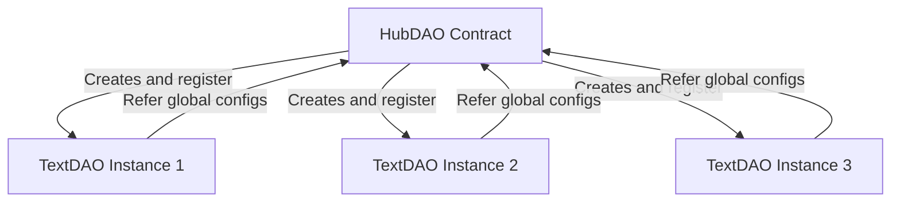

# TextDAO Contract Relationships

This document outlines the relationships between the various contracts in the TextDAO ecosystem, providing a visual representation and detailed explanation of their interactions.

## Contract Relationship Diagram

## HubDAO and TextDAO Relationship

HubDAO serves as the factory and manager for TextDAO instances:

1. **Creation**: The HubDAO contract is responsible for creating new TextDAO instances. It acts as a factory, deploying new TextDAO contracts when requested.

2. **Management**: HubDAO maintains a list of all TextDAO instances it has created. This allows for centralized management and provides a single point of reference for the entire TextDAO ecosystem.

3. **Configuration**: HubDAO sets global configurations that apply to all TextDAO instances. This ensures consistency across the ecosystem.

4. **Upgrades**: HubDAO coordinates upgrades for TextDAO instances, leveraging the upgradeability features provided by the Meta Contract.

## Inter-Contract Communication

1. HubDAO to TextDAO:
   - HubDAO can create new TextDAO instances
   - HubDAO can upgrade the functions of TextDAO

2. TextDAO to HubDAO:
   - TextDAO may need to query HubDAO for global configurations or permissions

3. TextDAO to VRF Coordinator:
   - TextDAO requests random numbers and receives callbacks from the VRF Coordinator

## Key Considerations

1. **Scalability**: This architecture allows for the creation of numerous TextDAO instances without significant overhead, as each instance is a lightweight clone using the MC-Std functions library.

2. **Upgradeability**: The use of the UCS architecture through the MC-Devkit allows for flexible upgrades, both at the individual TextDAO level and ecosystem-wide through HubDAO coordination.

3. **Centralized Management**: While individual TextDAOs operate autonomously, the HubDAO provides a centralized point for ecosystem-wide management and upgrades.

4. **Isolation**: Each TextDAO instance operates independently, with its own storage and state, ensuring that issues in one DAO do not directly affect others.

5. **Extensibility**: The architecture allows for easy addition of new features or TextDAO variants by extending the MC library and updating the HubDAO contract.

## Conclusion

The relationship between HubDAO and TextDAO instances forms a flexible and scalable architecture for the TextDAO ecosystem. This design allows for efficient management of multiple DAOs while providing upgradeability and maintaining independence of individual instances. As the project evolves, this architecture provides a solid foundation for adding new features and scaling the ecosystem.
