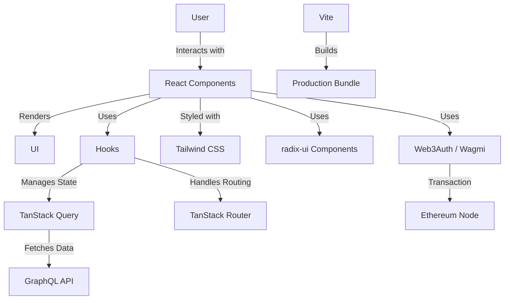

# TextDAO Frontend Architecture

This document provides an overview of the TextDAO frontend architecture, detailing its components and how they interact to create a seamless user experience for interacting with TextDAO.

## Overview

The TextDAO frontend is a React-based single-page application (SPA) built with TypeScript and Vite. It utilizes modern web technologies and follows best practices for performance, maintainability, and scalability.

## Key Components

1. **React**: The core library for building the user interface.
2. **TypeScript**: Provides static typing for improved developer experience and code quality.
3. **Vite**: Build tool and development server for fast builds and hot module replacement.
4. **TanStack Router**: Handles client-side routing.
5. **TanStack Query**: Manages server state and caching.
6. **Tailwind CSS**: Utility-first CSS framework for styling.
7. **Web3Auth / Wagmi**: Ethereum account management and utility for interaction.

## Architecture Diagram

## Key Design Decisions

1. **Component-Based Architecture**: The UI is composed of reusable React components, promoting modularity and maintainability.
2. **State Management**: TanStack Query is used for server state management, while React's built-in hooks (useState, useContext) handle local component state.
3. **Routing**: TanStack Router provides type-safe routing and code splitting for improved performance.
4. **Styling**: Tailwind CSS is used for rapid UI development and consistent styling across the application.
5. **Accessibility**: radix/ui components are used to ensure a high level of accessibility out of the box.

## Data Flow

1. User interactions trigger state changes or data fetching operations.
2. TanStack Query manages API requests, caching, and synchronization with the server.
3. React components re-render based on state changes, updating the UI.
4. TanStack Router handles navigation between different views without full page reloads.

## Performance Considerations

- Code splitting is implemented to reduce initial bundle size and improve load times.
- TanStack Query's caching mechanism reduces unnecessary network requests.
- Vite's build optimization ensures efficient production bundles.

## Security Measures

- All user inputs are sanitized to prevent XSS attacks.
- Environment variables are used to store sensitive information.
- HTTPS is enforced for all API communications.

## Future Considerations

- Implementation of more advanced caching strategies for improved offline support.
- Integration with progressive web app (PWA) features for enhanced mobile experience.

For more detailed information on UI components, please refer to the [UI Components](ui-components.md) document.
