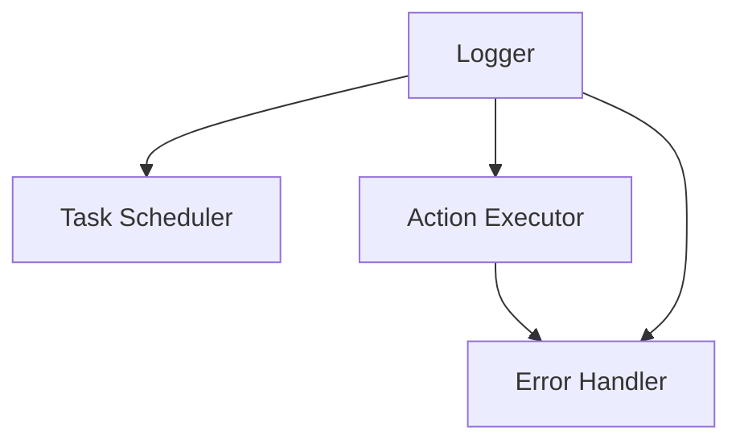

# TextDAO Keeper Architecture

This document provides an overview of the TextDAO Keeper's architecture, detailing its components and how they interact to automate DAO operations.

## Overview

The TextDAO Keeper is designed with modularity and extensibility in mind. It consists of several key components that work together to monitor the DAO's state, execute necessary actions, and maintain the system's health.

## Key Components

1. **Task Scheduler**: Manages the timing and execution of various keeper tasks.
2. **Action Executor**: Handles the execution of DAO actions, such as proposal execution and tallying.
4. **Error Handler**: Manages errors and implements retry mechanisms.
5. **Logger**: Provides logging and monitoring capabilities.

## Architecture Diagram

## Component Details

### Task Scheduler

The Task Scheduler is responsible for:
- Defining and managing the schedule of keeper tasks
- Triggering tasks based on time or blockchain events
- Ensuring tasks don't overlap or conflict

### Action Executor

The Action Executor:
- Prepares and sends transactions to the Ethereum network
- Handles different types of actions (proposal execution, tallying, etc.)
- Manages transaction nonces and handles transaction replacement if needed

### Error Handler

The Error Handler:
- Catches and logs errors from various components
- Implements retry mechanisms with exponential backoff
- Alerts administrators of critical errors

### Logger

The Logger:
- Provides structured logging for all keeper operations
- Integrates with monitoring systems for real-time alerts
- Stores logs for auditing and debugging purposes

## Data Flow

1. The Task Scheduler triggers a task (e.g., check for executable proposals)
2. If action is needed, the Action Executor prepares the transaction
5. The Action Executor sends the transaction to the Ethereum network
6. The Error Handler manages any errors that occur during the process
7. The Logger records all activities and outcomes

## Scalability and Performance

- The Keeper is designed to handle multiple DAOs and high transaction volumes
- Concurrent execution of non-conflicting tasks is supported
- Database caching is used to reduce load on the Ethereum node

## Security Considerations

- Private keys are securely managed and never exposed in logs
- All external data inputs are validated to prevent injection attacks
- Rate limiting is implemented to prevent accidental DoS on the Ethereum node

## Future Improvements

- Implementation of a plugin system for easy addition of new tasks
- Advanced analytics and reporting features for DAO operators

For more detailed information on the Keeper's specifications, please refer to the [Keeper Specification](keeper-spec.md) document.
