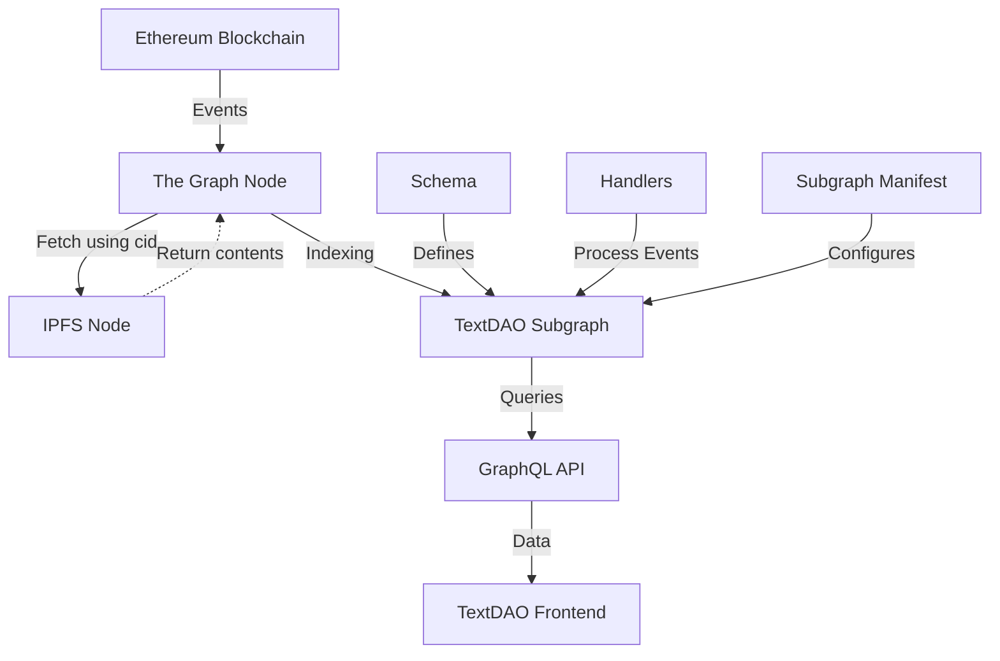

# TextDAO Subgraph Architecture

This document provides an overview of the TextDAO subgraph architecture, detailing its components and how they interact to index and serve data from the TextDAO smart contracts.

## Overview

The TextDAO subgraph is built on [The Graph protocol](https://thegraph.com/docs/en/), which allows for efficient indexing and querying of blockchain data. It consists of several key components that work together to process events from the TextDAO smart contracts and make the data available through a GraphQL API.

## Key Components

1. **Schema**: Defines the structure of the data that the subgraph will index and make available for querying.
2. **Handlers**: AssemblyScript functions that transform blockchain events into entities defined in the schema.
3. **Subgraph Manifest**: YAML file (subgraph.yaml) that configures the subgraph, specifying which smart contracts to index and how to handle their events.
4. **AssemblyScript API**: Provided by The Graph, used in handlers to interact with the subgraph store.

## Architecture Diagram

## Data Flow

1. TextDAO smart contracts emit events on the Ethereum blockchain.
2. The Graph Node detects these events based on the subgraph configuration.
3. Event data is passed to the appropriate handler functions.
4. Handlers process the event data and create or update entities in the subgraph store. And also process the file source data from IPFS, if needed.
5. The GraphQL API allows querying of the indexed data.
6. The TextDAO frontend (or other clients) can efficiently retrieve data through GraphQL queries.

## Key Design Decisions

- **Entity Relationships**: The schema is designed to reflect the relationships between different aspects of the TextDAO system, such as proposals, votes, and members.
- **Efficient Indexing**: Handlers are optimized to minimize computational overhead during the indexing process.
- **Scalability**: The architecture is designed to handle increasing amounts of data as the TextDAO system grows.

## Future Considerations

- Implementation of more complex aggregations and statistics at the subgraph level.
- Exploration of subgraph composition for modular and reusable components.

For more detailed information on the subgraph specification, please refer to the [Subgraph Specification](subgraph-spec.md) document.
